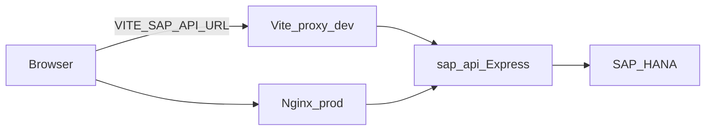

# Integración SAP HANA

Este proyecto se conecta a **SAP HANA** mediante el driver oficial de Node [`@sap/hana-client`](https://www.npmjs.com/package/@sap/hana-client). Las consultas son **SQL directo** contra tablas del esquema `PRODU_HEXA`. No hay RFC, OData ni BAPI documentados en el código.

---

## Arquitectura y flujo de datos

### Desarrollo local

1. El navegador usa `VITE_SAP_API_URL` (típicamente `/sap-api`).
2. Vite hace **proxy** de `/sap-api` hacia `http://localhost:3006` y reescribe el path (sin el prefijo `/sap-api`).
3. El mini servidor Express ejecuta SQL en HANA.

### Producción (Docker + Nginx)

1. El cliente llama a `https://<dominio>/sap-api/...`.
2. Nginx (`deploy/nginx.conf`) hace `proxy_pass` al servicio Docker `sap-api` en el puerto interno configurado (`PORT`, por defecto `3006`).
3. El contenedor usa las mismas variables HANA que en desarrollo, cargadas desde `server/.env.production`.



### Referencias en código

| Pieza | Ubicación |
|-------|-----------|
| Proxy Vite | [`vite.config.ts`](../vite.config.ts) |
| Proxy Nginx `/sap-api/` | [`deploy/nginx.conf`](../deploy/nginx.conf) |
| Servicio Docker `sap-api` | [`docker-compose.yml`](../docker-compose.yml) |
| Cliente HANA | [`server/src/db/hanaClient.ts`](../server/src/db/hanaClient.ts) |
| Rutas API | [`server/src/routes/api.ts`](../server/src/routes/api.ts) |
| Consultas Maringo | [`server/src/controllers/maringoController.ts`](../server/src/controllers/maringoController.ts) |
| UI informe SAP | [`src/components/hr/SapUserReportSection.tsx`](../src/components/hr/SapUserReportSection.tsx) |

---

## Backend: cliente HANA y comportamiento

Implementación: [`server/src/db/hanaClient.ts`](../server/src/db/hanaClient.ts).

### Parámetros de conexión

Se construyen a partir de variables de entorno:

| Parámetro del cliente | Origen |
|----------------------|--------|
| `serverNode` | `HANA_HOST` + `:` + `HANA_PORT` |
| `uid` | `HANA_USER` |
| `pwd` | `HANA_PASSWORD` |
| `databaseName` | `HANA_DATABASE` |

### Arranque y modo degradado

Al iniciar el proceso ([`server/src/index.ts`](../server/src/index.ts)), se llama a `db.connect()`: se abre una conexión de prueba y se cierra. Si falla, el servidor **sigue arrancando** pero queda en modo degradado (HANA no disponible).

- `isConfigured()` es verdadero solo si están definidos **no vacíos**: `HANA_HOST`, `HANA_PORT`, `HANA_USER`, `HANA_PASSWORD`.  
- `HANA_DATABASE` se envía al cliente aunque no entre en el chequeo de configuración.
- Cada `execute()` abre conexión, ejecuta la consulta y cierra.

---

## Endpoints HTTP

Prefijo de rutas de negocio: **`/api`**. El health va en la raíz del servicio.

### Rutas del servicio Express (sin prefijo público `/sap-api`)

| Método | Ruta | Descripción |
|--------|------|-------------|
| `GET` | `/health` | Estado del servicio y de HANA (`hanaConfigured`, `hanaAvailable`, `hanaError`) |
| `GET` | `/api/maringo/employees` | Lista de empleados (tabla `MPPERSONENSTAMM`) |
| `GET` | `/api/maringo/user-project-report?employeeId=` | Informe de horas/proyectos por empleado |
| `GET` | `/api/maringo/maestro-servicios` | Maestro de servicios / Leistung (SQL configurable) |

### URLs que ve el navegador

Con prefijo `/sap-api` (desarrollo con proxy o producción con Nginx):

- Salud: `GET /sap-api/health`
- Empleados: `GET /sap-api/api/maringo/employees`
- Informe: `GET /sap-api/api/maringo/user-project-report?employeeId=<id>`
- Maestro: `GET /sap-api/api/maringo/maestro-servicios`

El frontend construye la base con `import.meta.env.VITE_SAP_API_URL` (por defecto `/sap-api`). Ver [`SapUserReportSection.tsx`](../src/components/hr/SapUserReportSection.tsx).

### Validación de `employeeId`

En el informe por usuario, el query param `employeeId` debe cumplir la expresión regular `^[0-9A-Za-z_-]{1,32}$`. Si no, respuesta `400`.

### Códigos de error habituales

- **`503`**: HANA no disponible (`ensureSapAvailable` en el controlador).
- **`500`**: Error de consulta o configuración inválida del maestro servicios.

En producción (`NODE_ENV=production`), los cuerpos JSON de error suelen omitir `details` para no filtrar información interna.

---

## Datos en HANA (objetos consultados)

Definido en [`maringoController.ts`](../server/src/controllers/maringoController.ts).

### Empleados

- Tabla: `"PRODU_HEXA"."MPPERSONENSTAMM"`
- Columnas seleccionadas: `PERSONALNUMMER` → `id`, `VORNAME`, `NACHNAME`, `EMAIL`
- Límite: 500 filas

### Informe usuario–proyecto

- Desde `"PRODU_HEXA"."MPPROJEKTBUCHUNGSERFASSUNG"` (`t`), con `LEFT JOIN` a `"PRODU_HEXA"."MPPROJEKTSTAMM"` (`p`) y `"PRODU_HEXA"."MPPERSONENSTAMM"` (`e`).
- Filtros sobre proyectos: nombre/número que no contengan `Hexa`, y `PROJEKTINTERN` nulo o `0`.
- Agregación: `SUM(t.MENGE)` como horas; año desde `YEAR(t.LEISTUNGSTAG)`; cliente derivado de `OCRCODE1` o prefijo de `PROJEKTNAME` antes de `:`.

### Maestro servicios

Por defecto:

- Esquema/tabla: `"PRODU_HEXA"."MPLEISTUNG"`
- Columnas: `LEISTUNGSNUMMER` (código), `MATCHCODE` (match code), orden por código, máximo 5000 filas.

Se puede sustituir por un `SELECT` completo con la variable `HANA_MAESTRO_SERVICIOS_SQL`, o componer el SQL con `HANA_MAESTRO_SERVICIOS_SCHEMA`, `HANA_MAESTRO_SERVICIOS_TABLE`, `HANA_MAESTRO_SERVICIOS_CODE_COLUMN`, `HANA_MAESTRO_SERVICIOS_MATCH_COLUMN`. Los identificadores deben pasar validación alfanumérica (ver código: `isSafeHanaIdent`).

---

## Variables de entorno y secretos

**No commitees valores reales** (hosts internos, usuarios y contraseñas de producción). Usa solo [`server/.env.example`](../server/.env.example) como plantilla.

### Tabla resumen

| Variable | Propósito | ¿Secreto / sensible? | Notas |
|----------|-----------|----------------------|--------|
| `HANA_HOST` | Host del servidor HANA | Sí (infra interna) | Ejemplo de forma: `hanadb.ejemplo.corp` |
| `HANA_PORT` | Puerto SQL | No | Típico `30015` (ejemplo en `.env.example`) |
| `HANA_USER` | Usuario de base de datos | **Sí** | Rotación según política SAP |
| `HANA_PASSWORD` | Contraseña | **Sí** | Nunca en git ni en capturas |
| `HANA_DATABASE` | Nombre de base | Depende del entorno | Ejemplo documentado: `NDB` |
| `PORT` | Puerto HTTP del mini servidor | No | Por defecto `3006` |
| `NODE_ENV` | Entorno Node | No | `production` reduce detalles en errores API |
| `CORS_ALLOWED_ORIGINS` | Orígenes permitidos (lista separada por comas) | No | Ej. `http://localhost:8080` en dev |
| `TRUST_PROXY` | Confianza en cabeceras proxy (`express`) | No | En prod suele usarse `loopback` o según despliegue |
| `RATE_LIMIT_WINDOW_MS` | Ventana rate limit (ms) | No | Por defecto `60000` |
| `RATE_LIMIT_MAX` | Máximo de peticiones por ventana | No | Por defecto `120` |
| `HANA_MAESTRO_SERVICIOS_SQL` | SQL completo opcional para maestro | No (pero revisar que no filtre datos indebidos) | Reemplaza el SELECT por defecto |
| `HANA_MAESTRO_SERVICIOS_SCHEMA` | Esquema tabla maestro | No | Default `PRODU_HEXA` |
| `HANA_MAESTRO_SERVICIOS_TABLE` | Tabla maestro | No | Default `MPLEISTUNG` |
| `HANA_MAESTRO_SERVICIOS_CODE_COLUMN` | Columna código | No | Default `LEISTUNGSNUMMER` |
| `HANA_MAESTRO_SERVICIOS_MATCH_COLUMN` | Columna match | No | Default `MATCHCODE` |

### Frontend (Vite)

| Variable | Propósito | ¿Secreto? |
|----------|-----------|-----------|
| `VITE_SAP_API_URL` | Base URL del API SAP para `fetch` | No |

Es una variable **de compilación**: se inyecta en el build del frontend. En local suele ser `"/sap-api"` para alinear con el proxy de Vite.

### Dónde colocar cada archivo

| Entorno | Archivo | Descripción |
|---------|---------|-------------|
| Desarrollo local | `server/.env` | Copia desde `server/.env.example` y rellena |
| Docker Compose | `server/.env.production` | Referenciado en [`docker-compose.yml`](../docker-compose.yml) como `env_file` del servicio `sap-api` |
| VM (canónico para CI) | `/etc/hexa/sap-api.env` | Plantilla base: [`deploy/sap-api.env.example`](../deploy/sap-api.env.example). El workflow [`.github/workflows/deploy-vm.yml`](../.github/workflows/deploy-vm.yml) **copia** este archivo a `server/.env.production` antes de `docker compose up` |

El runner self-hosted debe tener presente `/etc/hexa/sap-api.env`; si falta, el deploy falla en el paso “Ensure SAP env file exists on VM”.

---

## Scripts auxiliares

Ambos usan `@sap/hana-client` y leen `server/.env` (mismas variables `HANA_*`).

| Script | Uso |
|--------|-----|
| [`server/scripts/probe-maestro-servicios.ts`](../server/scripts/probe-maestro-servicios.ts) | Diagnóstico: inspecciona tablas del esquema `PRODU_HEXA` relacionadas con maestro servicios. Ej.: `npx ts-node scripts/probe-maestro-servicios.ts` desde `server/` |
| [`server/scripts/export-maestro-servicios-xlsx.ts`](../server/scripts/export-maestro-servicios-xlsx.ts) | Exporta Excel con maestro `MPLEISTUNG` (código + match code). Ej.: `npx ts-node scripts/export-maestro-servicios-xlsx.ts` desde `server/` |

---

## Verificación y resolución de problemas

### Comprobar salud del API

```bash
# En la VM (puerto 80 expuesto al Nginx)
curl http://127.0.0.1/sap-api/health
```

Respuesta JSON relevante:

- `hanaConfigured: false` → Faltan variables obligatorias (`HANA_HOST`, `HANA_PORT`, `HANA_USER`, `HANA_PASSWORD`).
- `hanaAvailable: false` → Credenciales configuradas pero la conexión a HANA falla (red, firewall, credenciales incorrectas, instancia caída). Revisar `hanaError`.
- En desarrollo, si HANA no está disponible, el servidor puede seguir vivo; las rutas `/api/maringo/*` responderán `503`.

### Errores en la UI “Informe SAP”

Mensajes como no poder cargar empleados o informe suelen indicar backend caído, proxy mal configurado, o HANA en modo degradado. Comprobar consola del servidor y `/sap-api/health`.

### Rate limiting y CORS

Las rutas bajo `/api` tienen rate limit ([`server/src/index.ts`](../server/src/index.ts)). Si el frontend en producción usa otro origen, debe incluirse en `CORS_ALLOWED_ORIGINS`.

---

## Seguridad

- Tratar `HANA_USER` y `HANA_PASSWORD` como secretos de infraestructura; rotación y alcance mínimo en HANA.
- No subir `.env` ni `.env.production` con valores reales al repositorio.
- La documentación describe **nombres** de variables y **ubicación** de archivos; no sustituye un gestor de secretos corporativo si el equipo adopta uno más adelante.
